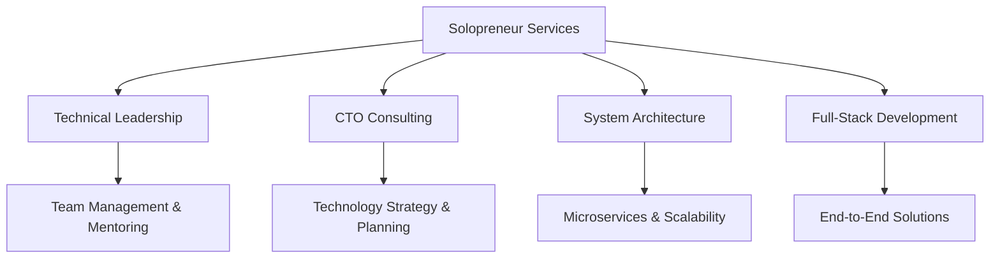

<h1 align="center">
  
<a href="https://git.io/typing-svg"></a>
  
</h1>

<p align="center">
  
  
  
   
</p>

<div align="center">

### 🚀 **Available for Tech Lead, CTO, IC Consulting** 🚀

*Building scalable systems | Leading development teams | Architecting solutions*

</div>

---

## 💼 About Me

```javascript
const sumeet = {
    name: "Sumeet Kumar",
    location: "Gurgaon, Haryana, India",
    currentStatus: "Solopreneur",
    sumamry: "Seasoned engineer with a strong track record in designing and scaling high-performance microservices",
             "leading teams, and delivering measurable impact. Previously Technical Lead at Paytm",
             "now a solopreneur helping startups and teams ship production-grade systems and level up engineering practices.",
    expertise: ["Tech Leadership", "System Architecture", "Full-Stack Development"],
    availability: "Open to consulting & fractional leadership",
    experience: "7+ years",
    previousRole: "Technical Lead at Paytm",
    services: {
        techLead: "Leading development teams with proven methodologies",
        cto: "Strategic technology decisions for startups",
        fullStack: "End-to-end development with modern tech stack",
        architecture: "Designing scalable microservices systems"
    },
    achievements: {
        teamLead: "Led teams delivering 20% increased user engagement",
        performance: "Improved system performance by 30%",
        scale: "Built systems handling 5M+ daily requests",
        efficiency: "Reduced response times to ~70ms"
    },
    strengths: [
      "Systems design & microservices", "Performance engineering",
      "Developer experience", "Scalability & reliability", "Team mentoring"
    ],
};
```
---

<picture>
  <source media="(prefers-color-scheme: dark)" srcset="https://raw.githubusercontent.com/sumeetkbhardwaj/sumeetkbhardwaj/output/github-contribution-grid-snake-dark.svg">
  <source media="(prefers-color-scheme: light)" srcset="https://raw.githubusercontent.com/sumeetkbhardwaj/sumeetkbhardwaj/output/github-contribution-grid-snake.svg">
  
</picture>

---

## 📊 GitHub Stats

<div align="center">
  
<!-- GitHub Stats Card -->


<!-- Most Used Languages -->


  
<!-- GitHub Streak Stats -->


</div>

<div align="center">
  
<!-- GitHub Activity Graph -->


</div>

<div align="center">

<!-- Contribution Snake Game -->
<picture>
  <source media="(prefers-color-scheme: dark)" srcset="https://raw.githubusercontent.com/sumeetkbhardwaj/sumeetkbhardwaj/output/github-contribution-grid-snake-dark.svg">
  <source media="(prefers-color-scheme: light)" srcset="https://raw.githubusercontent.com/sumeetkbhardwaj/sumeetkbhardwaj/output/github-contribution-grid-snake.svg">
  
</picture>

</div>

---

## 🎯 Professional Services

<table>
<tr>
<td width="50%">

### 👨‍💼 Technical Leadership
- **Team Management**: Leading remote and on-site development teams
- **Mentoring**: Guiding junior developers and improving team skills  
- **Process Optimization**: Implementing agile methodologies and best practices
- **Project Delivery**: Ensuring on-time milestone delivery with quality

</td>
<td width="50%">

### 🎯 CTO Consulting
- **Technology Strategy**: Making strategic technology decisions for startups
- **Architecture Design**: Planning scalable system architectures
- **Technology Selection**: Choosing the right tech stack for your needs
- **Investment Guidance**: Technical due diligence for investors

</td>
</tr>
<tr>
<td width="50%">

### 💻 Full-Stack Development
- **Frontend**: React, Vue.js, Angular with responsive design
- **Backend**: Microservices, APIs, and distributed systems
- **Database**: Design and optimization for high performance
- **DevOps**: CI/CD pipelines, containerization, cloud deployment

</td>
<td width="50%">

### 🏗️ System Architecture
- **Microservices**: Designing and implementing distributed architectures
- **Scalability**: Building systems that handle millions of requests
- **Performance**: Optimizing for speed and reliability
- **Security**: Implementing robust security measures

</td>
</tr>
</table>

---

## 📈 Professional Achievements

### 🏆 **Paytm (Technical Lead)** - *July 2023 to July 2025*
- 🎮 **Led Callbreak Game Development** - Achieved 20% increase in user engagement
- 🚀 **Cross-Platform Excellence** - 30% improvement in code efficiency, 25% reduction in response time
- ⚡ **High-Scale Systems** - Built Java systems handling 5M+ daily requests
- 📊 **Team Leadership** - Successfully managed cross-team coordination and deliveries

### 🏆 **OLX Group (SDE 2)** - *February 2021 to July 2023*
- 🌐 **Distributed Systems** - Built scalable systems for high-volume data processing
- 🚀 **Performance Optimization** - Reduced response time to ~70ms through intelligent caching
- 📊 **GraphQL APIs** - Scaled to handle 1M+ requests per day
- 🔧 **System Reliability** - Implemented monitoring across services using NewRelic

### 🏆 **Freecharge (SDE-A3)** - *May 2020 to February 2021*
- 🏗️ **API Gateway** - Built streaming data processing system
- 📊 **Reporting System** - Reduced finance team manual effort by 80%
- ⚡ **Performance Engineering** - Processed 1GB+ Excel files in under 5 minutes
- 👥 **Team Leadership** - Led and mentored development teams on large-scale projects

---

## 💡 Current Focus



---

## 🛠️ I can work with any of these as an Engineer

<div align="left">

### **Languages**


### **Frameworks & Libraries**


### **Databases**


### **Messaging & Streaming**


### **Cloud & DevOps**


### **CI/CD & Build**


### **Observability**


### **Testing & Quality**


### **API Standards & Protocols**


### **Security & Auth**


### **Data & AI**


### **Architectures & Patterns**


### **Tooling & Collaboration**


### **Domain Expertise**


</div>

---

<div align="left">

### 🎯 **Looking to collaborate on:**
- 🏗️ **System Architecture & Design**
- 🚀 **Startup Technology Leadership** 
- 💻 **Full-Stack Development Projects**
- 👥 **Team Building & Technical Mentoring**

</div>

---

## 🤝 Connect With Me

<div align="center">

[](https://www.linkedin.com/in/sumeetkbhardwaj)
[](mailto:sumitsk20@gmail.com)
[](https://twitter.com/sumeetkbhardwaj)

### 📧 **Available for Consulting** - Let's discuss your next project!

[](mailto:sumitsk20@gmail.com?subject=Consulting%20Inquiry)

</div>

---

<div align="center">

### ⭐ **If you find my work interesting, please star my repositories!** ⭐


**Thank you for visiting my profile!** 🙏

**Let's build something amazing together!** 🚀

</div>

